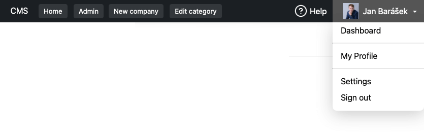
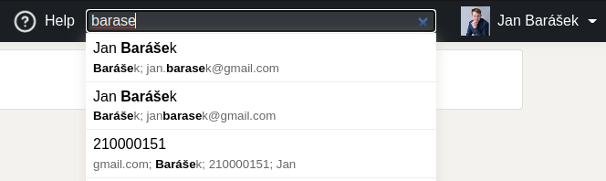

Admin bar
=========

Advanced admin panel for convenient management of the web application and administration interface (CMS).

AdminBar is an interactive tool for quick navigation between the website, the CMS, the user profile or the pages you define.



📦 Installation
---------------

It's best to use [Composer](https://getcomposer.org) for installation, and you can also find the package on
[Packagist](https://packagist.org/packages/baraja-core/admin-bar) and
[GitHub](https://github.com/baraja-core/admin-bar).

To install, simply use the command:

```
$ composer require baraja-core/admin-bar
```

You can use the package manually by creating an instance of the internal classes, or register a DIC extension to link the services directly to the Nette Framework.

To use the AdminBarExtension, implement AdminIdentity.php into your project.

AdminBar will adapt to what you are doing
-----------------------------------------

The bar provides a simple API for developers to easily influence what the user sees at the moment. You can easily add custom buttons to perform contextual actions, change the color of the bar in unsafe mode, or display useful information.


You can also register custom micro-applications directly inside panel, such as full-text search across the entire system, or direct user profile management.



Creating a web template
-----------------------------------------
Navigation bars positioned at the top of the page, may not include CSS top property because of the proper display of the AdminBar.
